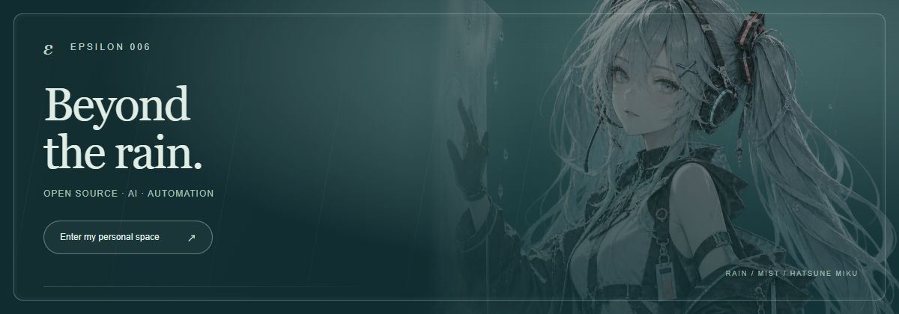

  <a href="https://epsilon006.github.io/"><strong>Enter my personal space ↗</strong></a>
  &nbsp; · &nbsp;
  <a href="https://github.com/Epsilon006?tab=repositories">Browse repositories</a>

---

## AI Agent Engineering

Building reliable agent systems and exploring the infrastructure behind long-running AI applications.

**Focus**  
Agent Runtime · Execution Persistence · Human-in-the-Loop · Tool Orchestration · Multi-Agent Systems · Browser Automation

**Tech**  
Python · LangGraph · Deep Agents · SSE · REST APIs · Git

**Exploring**  
MCP · Agent Protocols · Long-Running Agents · AI Infrastructure

---

Open source · Agent infrastructure · Developer tooling
