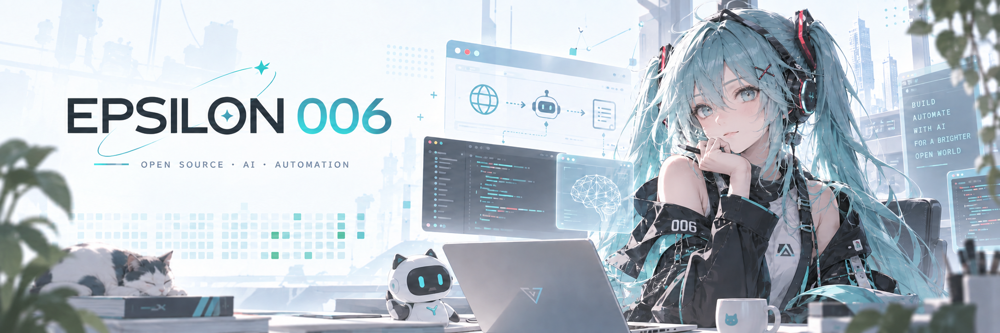

  

<a href="https://epsilon006.github.io"><strong>Enter the rainspace ↗</strong></a>

## AI Agent Engineering

Building reliable agent systems and exploring the infrastructure behind long-running AI applications.

**Focus**

Agent Runtime · Execution Persistence · Human-in-the-Loop · Tool Orchestration · Multi-Agent Systems · Browser Automation

**Tech**

Python · LangGraph · Deep Agents · SSE · REST APIs · Git

**Exploring**

MCP · Agent Protocols · Long-Running Agents · AI Infrastructure

---

Open source · Agent infrastructure · Developer tooling

<!--
**Epsilon006/Epsilon006** is a ✨ _special_ ✨ repository because its `README.md` (this file) appears on your GitHub profile.

Here are some ideas to get you started:

- 🔭 I’m currently working on ...
- 🌱 I’m currently learning ...
- 👯 I’m looking to collaborate on ...
- 🤔 I’m looking for help with ...
- 💬 Ask me about ...
- 📫 How to reach me: ...
- 😄 Pronouns: ...
- ⚡ Fun fact: ...
-->
